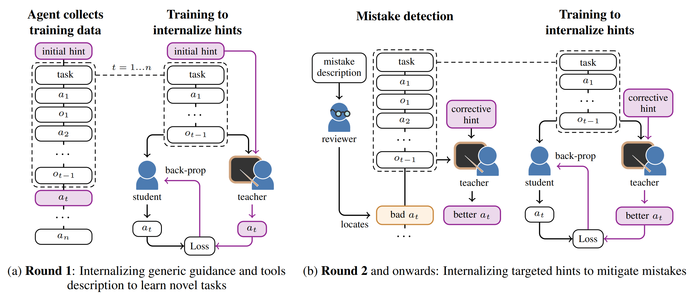

# Memento No More: Coaching AI Agents to Master Multiple Tasks via Hints Internalization


Official implementation of:
<p align="center"><b>Memento No More: Coaching AI Agents to Master Multiple Tasks via Hints Internalization</b><br>
Minttu Alakuijala*, Ya Gao*, Georgy Ananov, Samuel Kaski, Pekka Marttinen, Alexander Ilin, Harri Valpola<br>
<a href=https://arxiv.org/abs/2502.01562>[Paper]</a><br>

*Equal contribution



## 1. Setup

### 1.1 Clone this repo

```
git clone https://github.com/minttusofia/memento-no-more.git
cd memento-no-more
```

### 1.2 Create Python environment

```
python -m venv .venv
source .venv/bin/activate
make install
```

### 1.3 Configure ipython

* Create an IPython Profile
```
ipython profile create
```

* Navigate to the IPython profile directory indicated by the previous command. It's usually in a path like `~/.ipython/profile_default/`.

* Inside the `profile_default directory`, find the `startup` folder.

* Create a new Python file in this directory for your startup commands. You can name it anything, but for clarity, you might choose something like 00-autoreload.py.

* Open the file in a text editor and add your commands:

```
get_ipython().run_line_magic('reload_ext', 'autoreload')
get_ipython().run_line_magic('autoreload', '2')
```

* Create `01-nest_asyncio.py` with the following content:
```
__import__("nest_asyncio").apply()
__import__("dotenv").load_dotenv()
```
IMPORTANT: Without this step, you will not be able to run some notebooks in this repository.

* When you start ipython, the first cell should output `PID: <pid>`. The pid is useful to interrupt cells which cannot be interrupted by Ctrl-C or the "Interrupt" button (this happens sometimes). To interrupt such cells, open a terminal and type `kill -SIGINT <pid>` using the PID printed in the first cell.

* If automatic execution of those commands does not happen, you may try to set the following setting:
```
    "python.terminal.launchArgs": [
        "--profile=default"
    ],
```

### 1.4 Set up Huggingface or API keys

* To use Huggingface models, execute the following lines in python:
```
from huggingface_hub import login
login()
```
and input your token.

* To use OpenAI / Anthropic / DeepSeek APIs, add your tokens to `.env`.

### 1.5 Set up Weights and Biases

On terminal, run
```
wandb login
```

### 1.6 vLLM

For running the models locally, we use vLLM. Please refer to [vLLM documentation](https://docs.vllm.ai/en/latest/) for setup. By default, the code assumes that vLLM server runs on `http://localhost:8000/v1`.

### 1.7 VSCode

#### Running the code

The file `.env` contains API keys for various LLM providers. You can switch between them by using the appropriate `client` (see `agent/clients.py`).

The `.py` files containing `# %%` are intended for running interactively with IPython. Please install the Jypyter extension for this.

#### Recommended VSCode extensions

  * Python
  * Ruff (for linting)
  * Jupyter: will allow you to execute cells (marked with # %% in our code) in interactive python.
  * ANSI Colors: will allow you to see colors in the log files (output.ans)

#### Optional settings
Can be added to your workspace / user settings (`settings.json`):
* Creating a new ipython session for each file:
```
    "jupyter.interactiveWindow.creationMode": "perFile",
```

* Useful settings for jupyter cells:
```
    "jupyter.interactiveWindow.textEditor.executeSelection": true,
    "jupyter.debugJustMyCode": false,
```

* Making ipython cell outputs more readable:
```
    "notebook.output.wordWrap": true,
    "notebook.output.scrolling": true,
    "notebook.output.textLineLimit": 100,
```

## 2. Download datasets

Our corrected versions of ToolQA and OfficeBench datasets are included as subdirectories (git submodules) in this repo.

`TOOLQA_PATH` in `core/__init__.py` can be modified according to the ToolQA data location but is set by default to `tasks/t_ToolQA/ToolQA`.
OfficeBench data is read from `tasks/t_OfficeBench/OfficeBench`.

For ToolQA, you will additionally need to download the external corpus from https://github.com/night-chen/ToolQA/?tab=readme-ov-file#external-corpus-download and place it in `tasks/t_ToolQA/ToolQA/data/external_corpus`, while maintaining the modifications to the DBLP corpus already in `tasks/t_ToolQA/ToolQA/data/external_corpus/dblp`.

Original ToolQA repository: https://github.com/night-chen/ToolQA  
Original OfficeBench repository: https://github.com/zlwang-cs/OfficeBench

GSM8K: The GSM8K test data can be downloaded from: https://github.com/openai/grade-school-math/blob/master/grade_school_math/data/test.jsonl

## 3. Rerunning experiments

### 3.1. Launch a vLLM instance for the base model on a GPU cluster (skip this step if only evaluating an API):

```
python -u -m vllm.entrypoints.openai.api_server --model <model> --tokenizer <tokenizer> --dtype auto --api-key <token> --tensor-parallel-size <size>
```
e.g., to run Llama3.1-70B, run the following (this requires 8 GPUs)
```
python -u -m vllm.entrypoints.openai.api_server --model meta-llama/Meta-Llama-3.1-70B-Instruct --tokenizer meta-llama/Meta-Llama-3.1-70B-Instruct --dtype auto --api-key your-key --tensor-parallel-size 8
```
The `api-key` should match your `VLLM_SERVER_KEY` in `.env`.

To connect to the vLLM server, you will need need to set up port forwarding from the node from which the server is running to the machine on which you intend to run data collection (the latter can be a local machine without a GPU), e.g.:
```;
ssh -N -L 8000:<gpu node name>:8000 <login node name>
```
### 3.2. Collect data

#### ToolQA

Run `tasks/run_concurrent_ToolQA.py` in an interactive VSCode session. This file has multiple use cases:

- To collect task-specific teacher data (to train MNM Round 1 in Table 2), uncomment one of the tasksets under `# Option I. Collect training data with task-specific teacher`.

- To collect task-specific teacher data (to train MNM Round 1 in Table 5), uncomment one of the tasksets under `# Option V. Collect training data with task-specific teacher, holding out unseen tasks`.

#### OfficeBench

To collect training data for OfficeBench, run `tasks/run_concurrent_OfficeBench.py` in an interactive VSCode session and uncomment one of the tasksets under `# Option I. Collect training data with task-specific teacher`.


### 3.3. Train Round 1 agent on collected teacher data (from Options I or V)

Prepare a train config based on the provided `training/train_config_toolqa_round1.py`.
We only varied `train_patterns`, `val_patterns`, and `n_epochs` across benchmarks.
Point the config to the dataset you just created by setting `train_patterns` and `val_patterns`. Then run this file to launch training.

To instead run the cross-entropy variant, filter the training data to contain successes only and set `loss_type="xent"` in `RunConfig` within your training config file.

#### Merge the trained model
After training completes, merge the trained low-rank adapter (LoRA) with the base model to obtain a standalone model checkpoint by running `training/merge_adapter.py`. The model checkpoint will be saved in `MODEL_PATH/PROJECT_NAME/RUN_NAME`. PROJECT_NAME and RUN_NAME are defined in the train config and MODEL_PATH is set in `core/__init__.py`. Use this path as the `--model` argument in the vllm launch command to launch a vllm server with the trained model.

### 3.4. Collect data with the trained agent

Run `tasks/run_concurrent_ToolQA.py` or `tasks/run_concurrent_OfficeBench.py` with the model set to `vm-PROJECT_NAME/RUN_NAME` (it must be running as a vllm server) on the tasksets under `# Option IIIa. Evaluate without any guidance - train tasks`.

### 3.5. Inspect incorrect trajectories and design filters

Inspect the incorrect trajectories and design filters with `filters/llm-based_evaluate_hints.py` in an interactive VSCode session. This script defines hints to add, runs the teacher to get improved actions, and saves them as training data.

As described in our data balancing strategy, we also include full trajectory data generated with the newest trained agent with `# Option I. Collect training data with task-specific teacher` when otherwise insufficient data for certain tasks or task groups would be included, to avoid forgetting previously learned skills.

### 3.6. Train Round 2 agent

Prepare another training config and point it to the dataset you just created. Our configs were identical across rounds, except for `train_patterns`, `val_patterns`, `base_model` and `n_epochs`. Then run this file to launch training.

Merge the trained adapter as in Step 3.3.

### 3.7. Repeat steps 3.4 - 3.6 to train a Round 3 agent

### 3.8. Evaluate each agent on test tasks
Run `tasks/run_concurrent_ToolQA.py` or `tasks/run_concurrent_OfficeBench.py`:
* To evaluate a **trained MNM agent** on test tasks **(in Tables 2 and 4)**, uncomment one of the tasksets under `# Option IIIb. Evaluate without any guidance - test tasks`.
* To **evaluate the task-specific teacher on test tasks (Table 1 in the paper)**, uncomment one of the tasksets under `# Option II. Evaluate task-specific teacher on test tasks (hints optimized on test tasks)`.
- To evaluate one of the **combined hints baselines (in Tables 2 and 4)**, uncomment one of the tasksets under `# Option IV. Evaluate with combined hints`.

**GSM8K**:
To evaluate a model on GSM8K, run `run_concurrent_GSM8K.py` in an interactive VSCode session.

**HumanEval**: To evaluate a model on HumanEval, run `benchmarking/humaneval/run_humaneval.py` in an interactive VSCode session.

## 4. Trained models

Our trained models can be accessed from HuggingFace: https://huggingface.co/collections/yagao403/momento-no-more-683c4a7132ade965b6ce04bb.

## Citation

If you found this implementation useful, please cite our work as
```bibtex
@article{alakuijala2025memento,
    title={Memento No More: Coaching AI Agents to Master Multiple Tasks via Hints Internalization},
    author={Minttu Alakuijala and Ya Gao and Georgy Ananov and Samuel Kaski and Pekka Marttinen and Alexander Ilin and Harri Valpola},
    journal={arXiv preprint arXiv:2502.01562},
    year={2025},
}
```
